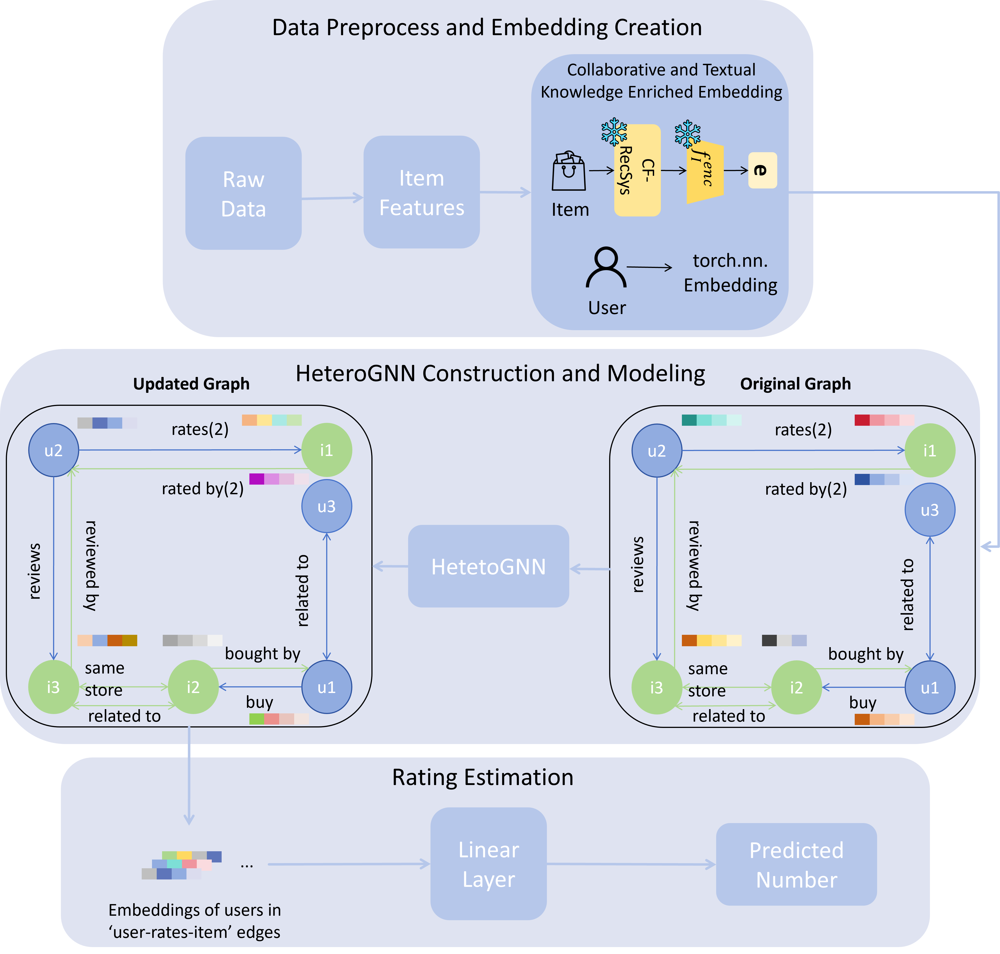

# CF-SBERTHet



## Overview
In this paper, we propose a novel recommendation system framework, called CF-SBERTHet, that unifies collaborative filtering knowledge and rich semantic information from user review texts within a heterogeneous graph neural network (HeteroGNN) architecture. CF-SBERTHet generates enriched user and item embeddings by fusing latent representations from a pre-trained collaborative filtering model with semantic features extracted using a Sentence-BERT (SBERT) model. These hybrid embeddings are integrated into a multi-typed heterogeneous graph, enabling the model to capture complex user–item, item–item, and user–user relationships through type-specific message passing. Extensive experiments conducted on four large-scale Amazon 2023 review datasets—Fashion, Beauty, Musical Instruments, and Movies and TV—demonstrate that CF-SBERTHet consistently surpasses a broad set of recent state-of-the-art baselines in both Root Mean Square Error (RMSE) and Mean Absolute Error (MAE).

## Env Setting
```
git clone https://github.com/Kyro-Ma/CF-SBERTHet.git
cd CF-SBERTHet

conda create -n [env name] python=3.12 pip
conda activate [env name]

pip install -r requirements.txt

cd Preprocess
python json_to_pkl_transformation.py
```
Our experiments were conducted on both Linux and Windows platforms using Python 3.12. The LLMs-based experiments were conducted on a Linux system equipped with 8 40GB A100 GPUs, while the Word2Vec-based experiments were performed on a Windows system with a NVIDIA RTX 4080 GPU. The CUDA versions used were 12.0 on Linux and 12.6 on Windows. For PyTorch, we used version 2.6.0+cu118 on Linux and 2.7.0+cu126 on Windows.

## Datasets
We conduct our experiments on four subsets of the Amazon 2023 dataset. The Amazon 2023 dataset, curated by the McAuley Lab, is a large-scale collection of Amazon product reviews gathered in 2023. It contains rich information, including user-generated reviews, detailed item metadata, and relational links. For our study, we focus on the Fashion, Beauty, Musical Instruments, and Movies and TV categories. The link to the datasets: https://amazon-reviews-2023.github.io. Should download metadata and reviews files and place them into data/amazon direcotory.

## Quick Usage
### Pre-train CF-RecSys (SASRec)
```
cd pre_train/sasrec
python main.py --device=cuda --dataset Movies_and_TV
```

### Train to get Collaborative and textual knowledge enriched embeddings
```
cd ../../
python item_embedding_creation.py --pretrain_stage1 --rec_pre_trained_data Movies_and_TV
```

### Train CF-SBERTHet/CF-SBERTHet-RW
```
python CF-SBERTHet.py/CF-SBERT-RW.py
```


